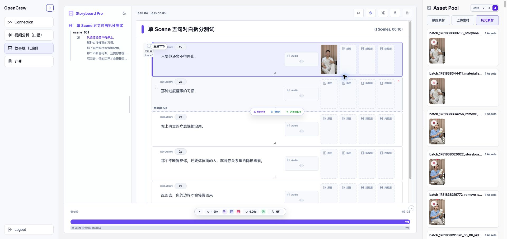
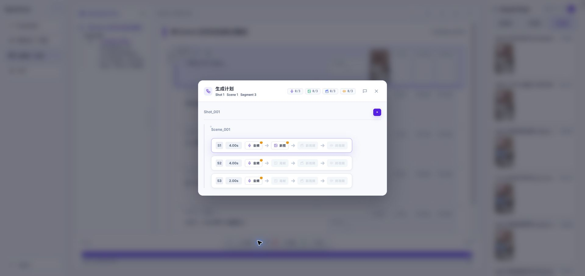
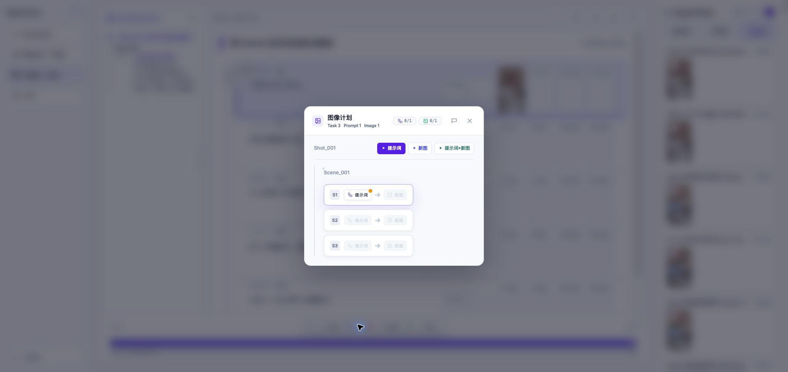
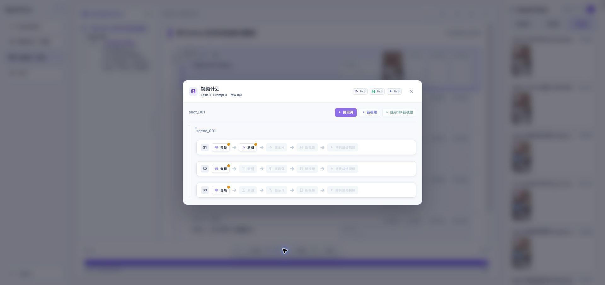

# Task #4 / Session #5 Plan UI Validation

测试时间：2026-06-19

## 测试输入

- StoryBoard：仅保留 Shot1 / Scene1。
- Dialogue：D1-D5，共 5 句。
- 每句时长：2s，总时长 10s。
- 生成计划配置：max=4s / min=2s / tolerance=0。
- 素材操作：从 History 拖拽 `srt_0001_Image_Source.jpg` 到 D1 原图槽，并保存。

预期 Segment：

| Segment | 包含 D | 时长 | 首帧来源 |
| --- | --- | ---: | --- |
| S1 | D1, D2 | 4s | D1 原图 |
| S2 | D3, D4 | 4s | S1 尾帧 |
| S3 | D5 | 2s | S2 尾帧 |

## 参考 HTML

- Video Plan：../koubo_segment_tailframe_exhaustive_matrix.html
- Image Plan：../koubo_image_plan_test_matrix.html
- Video Only Plan：../koubo_video_only_plan_test_matrix.html

## 实测截图

### StoryBoard 拖拽后

### Video Plan

实测显示 3 个 Segment：S1=4.00s，S2=4.00s，S3=2.00s；S2/S3 首帧显示为尾帧。

### Image Plan

实测显示 3 个 Segment；只有 S1 有原图可进入提示词/新图链路，S2/S3 因缺少原图显示禁用状态。

### Video Only Plan

实测显示 3 个 Segment；槽位严格为音频 -> 新图 -> 提示词 -> 新视频 -> 拷贝成终视频，不显示尾帧槽位。

## 后台校验

`video_generation_plan.json`：

- summary.segment_count = 3
- S1 dialogue_ids = `srt_0001`, `srt_0002`
- S2 dialogue_ids = `srt_0003`, `srt_0004`
- S3 dialogue_ids = `srt_0005`
- S2 first_frame.source_type = `previous_segment_tail_frame`
- S3 first_frame.source_type = `previous_segment_tail_frame`

`image_generation_plan.json` 和 `video_only_generation_plan.json` 都生成 3 个 task，对应同一组 S1/S2/S3。

## 备份

修改前的 Task #4 / Session #5 StoryBoard、Plan 缓存和旧 Working 文件已备份到：

`/private/tmp/koubo_task4_session5_backup_1781844663`
