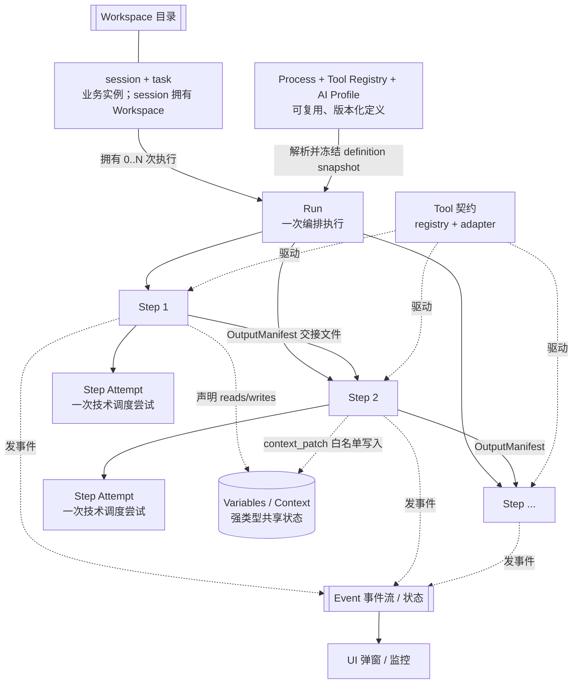

# FlowSpec — 声明式业务流程编排规范

> 一套用于**定义业务流程、工具脚本、变量与状态、文件工作区，以及 AI/Agent 调用与成本治理**的领域无关规范。
> 从 OpenCrew（口播/短视频生成）的工具会话（tool-session）模型抽取，
> 对照 Control-M、Airflow、Temporal、AWS Step Functions、Argo Workflows、BPMN/Camunda 校准，
> 目标是优先适配 LLM/多模态模型/本地 Agent 密集型系统，同时能指导**贷款审批、银行数据报告、大规模尽调、AI 视频创作**等不同业务领域的软件开发。

面向公司决策层与开发团队的可视化入口：[FlowSpec 规范综述](./index.html)。

版本：v0.4（草案，四场景可执行验证版）  ·  状态：核心概念已收敛；现行契约有代码导出 Schema + drift 测试；目标 Process/Tool Registry/Run/Artifact/AI Profile/AI Usage/Budget/Diagnostic Log/Storage Index 已物化为可校验契约；综述与四场景 demo 均纳入自动化契约与浏览器验收

---

## 这套规范在管什么

任何"一步步跑完的业务流程"，剥掉领域外衣后都在回答同样几个问题：

| 问题 | 规范中的要素 | 一句话 |
|---|---|---|
| 这条流程由哪些步骤、什么顺序、什么依赖组成？ | **Process（流程）** | 声明式定义，不写在代码控制流里 |
| 每一步具体让谁去干？ | **Tool（工具）** | 声明式契约 + 子进程适配器，工具不碰编排 |
| 这一步/整条流程共享哪些数据？ | **Variable / Context（变量与上下文）** | 强类型、作用域阶梯、白名单写入 |
| 每一步现在处于什么状态、卡在哪？ | **State（状态）** | 显式状态机 + 可查询的 wait 原因 |
| 输入、中间文件和产物放哪、怎么交接？ | **Workspace + Artifact + StorageIndex** | 兼容 OpenCrew 主骨架；只对 canonical output 做自动 hash/provenance，临时文件保持轻量 |
| 这次业务实例是谁、跑了几次？ | **session + task / Run（实例与运行）** | 身份分层，一次业务可有多次运行修订 |
| 出错了怎么办、日志落哪、卡住了谁知道？ | **Runtime + Event + Diagnostic Log** | 审计事件入库、Attempt 诊断落文件、服务日志进平台 sink |
| 模型怎么选、能看/做什么、花了多少？ | **AI Profile + Usage/Cost** | 冻结选择/权限/预算；每 Model Invocation 记 token、媒体单位与费用 |

---

## 一眼看懂：要素如何咬合

**身份分层**：`Process`（可复用定义）→ `session + task`（一次业务实例：session 拥有 Workspace/事件、task 存业务记录，1:1 配对）→ `Run`（一次编排执行）→ `Step`（逻辑调度节点）→ `Step Attempt`（一次技术调度尝试）→ Tool/Model Invocation（0..N 个实际操作）。完整业务生命周期可跨多个 Run 形成退回重审循环，但单次 Run 的步骤依赖图保持 DAG。

---

## 文件清单与阅读顺序

先读概念，再读你要落地的那一块，最后看示例。

| # | 文件 | 内容 | 读者 |
|---|---|---|---|
| — | [index.html](./index.html) | **双受众可视化综述**：背景、目的、核心模型、取舍、AI/成本治理、现状映射、路线图、文档和 Demo 入口 | 决策层/开发团队 |
| — | [README.md](./README.md) | 本文：索引与总览 | 所有人 |
| 00 | [00_Overview.md](./00_Overview.md) | 目标、范围、**本规范采取的关键设计取向（design positions）**、与成熟体系对照总表 | 架构/决策者 |
| 01 | [01_ConceptModel.md](./01_ConceptModel.md) | **概念层**：全部术语的领域无关定义与相互关系 | 所有人（必读） |
| 02 | [02_ProcessDefinition.md](./02_ProcessDefinition.md) | 流程定义规范：注册表、顺序、依赖（condition pool）、继承、计划确认/人工卡点 | 流程作者 |
| 03 | [03_ToolContract.md](./03_ToolContract.md) | 工具契约：声明式 registry、adapter 执行模型、I/O、幂等/确定性、成本标注 | 工具开发者 |
| 04 | [04_VariablesAndState.md](./04_VariablesAndState.md) | 变量与状态：类型化上下文、作用域阶梯、白名单写入、步骤状态机、可观测 wait | 平台/工具开发者 |
| 05 | [05_Workspace.md](./05_Workspace.md) | 文件工作区：兼容 OpenCrew 的 session/Run/Step/Attempt 目录、输入/中间文件/Artifact 位置、OutputManifest 与 StorageIndex | 平台/工具开发者 |
| 06 | [06_Runtime_Observability.md](./06_Runtime_Observability.md) | 运行时：依赖求值、资源、恢复、四种运行范围、事件/SSE、日志分层与级别、DB/文件/平台 sink、SLA | 平台开发者 |
| 07 | [07_ImplementationBinding.md](./07_ImplementationBinding.md) | **可实现绑定**：Schema 速记、命名/目录约定、状态枚举、事件契约 | 实现者 |
| — | [schema/](./schema/) | **正式 JSON Schema**：根目录由 [`_generate.py`](./schema/_generate.py) 从真实模型导出 `[implemented]`；`proposed/` 含目标 Process/Tool Registry/Run/Budget/Error/Checkpoint/AI Profile/AI Usage/Diagnostic Log/Storage Index；由 schema 与 demo 端到端测试回归 | 实现者 |
| 08 | [08_PriorArt_CrossReference.md](./08_PriorArt_CrossReference.md) | 与 Control-M / Airflow / Temporal / Step Functions / Argo / BPMN 的术语对照、我们取的立场、借鉴清单（带出处） | 架构/决策者 |
| 09 | [09_ProductionLessons.md](./09_ProductionLessons.md) | **从生产中长出来的教训**：OpenCrew 在真实用户业务里踩坑后长出的防御代码与 contract 测试提炼成的不变量（内容哈希门控、派生产物盖输入戳、持久"运行中"不可信、幂等=DB不变量、fail-closed、级联失效…） | **所有人（强烈推荐）** |
| 10 | [10_AI_ModelAndAgent_Profile.md](./10_AI_ModelAndAgent_Profile.md) | **AI-heavy Profile**：Model/Agent 边界、prompt/model 审计、权限、流式、重试、预算、逐调用 Usage/Cost | AI/平台开发者 |
| 11 | [11_FourScenarioValidation.md](./11_FourScenarioValidation.md) | 四场景综合能力矩阵、非单链条验证、Core/AI Profile/Domain 边界与落地优先级 | 架构/路线图评审 |
| 12 | [12_ExecutableDemos.md](./12_ExecutableDemos.md) | 四套可执行 demo 的目录契约、运行结果、验收命令与由 demo 推出的 v0.4 修订 | 所有人 |
| — | [demos/index.html](./demos/index.html) | 四场景入口；每页自包含 Process、双 Run、Artifact、Human Task、日志与物理位置索引、AI/成本和规范透视 | 评审/演示 |
| — | [examples/loan-approval.md](./examples/loan-approval.md) | 跨域**概念压力测试**①：**贷款审批流程**（`[proposed/illustrative]`，已过目标 Schema + linter） | 验证普适性 |
| — | [examples/bank-data-report.md](./examples/bank-data-report.md) | 跨域**概念压力测试**②：**银行数据挖掘 / 报告生成**（`[proposed]`） | 验证普适性 |
| — | [examples/due-diligence.md](./examples/due-diligence.md) | 跨域**概念压力测试**③：**大规模尽调材料自动处理**（`[proposed]`，含 fanout/quarantine 等未实现构件） | 验证普适性 |
| — | [examples/opencrew-video-creation.md](./examples/opencrew-video-creation.md) | 来源域压力测试④：**OpenCrew AI 视频创作与交付**（现行能力映射 + `[proposed]` 统一 Process） | 验证 AI/Agent/多模态适配性 |

---

## `examples/` 与 `demos/` 的关系

它们覆盖同一组四场景，但承担不同证据层级，并不是两套并列规范：

| 目录 | 定位 | 包含什么 | 权威边界 |
|---|---|---|---|
| `examples/` | **概念压力测试** | Markdown 形式的领域特点、专业边界、理想流程与规模化设想 | 用于解释“规范能否表达”；不作为可执行 Run 的事实源 |
| `demos/` | **可执行验收包** | Process/Registry/Schema、Mock Tool、输入 case、双 Run、Event/Log/Artifact/Usage、交互 HTML | 对该 Demo 的执行事实，以并列 JSON/NDJSON 与脚本为准；HTML 只是其 UI 投影 |

阅读时先用 `examples/*.md` 理解业务为什么这样建模，再进入 `demos/<scenario>/index.html` 看同一设计怎样被收敛为可校验契约。新增场景应先写清领域边界，再按 `demos/loan-approval/` 的目录契约物化；不再为 Markdown 生成镜像 HTML。

---

## 分层说明（本规范怎么"分层"）

每个要素文件都分两层写：

- **概念层（Concept）**——领域无关的定义、职责、取舍。指导你怎么*想*这个问题，不绑定任何实现。
- **可实现绑定（Binding）**——具体的 JSON Schema、字段、命名约定、状态枚举、目录结构。可以直接照着写代码。

上层稳定，下层可替换。你可以只采纳概念层，用自己的技术栈实现绑定；也可以直接照搬绑定层落地。

---

## ⚑ 状态标注规范（v0.2 起，现状声明强制）

> 团队审核指出 v0.1 把三种成熟度混写了。为避免把目标设计误读成现网能力，**凡声称 OpenCrew 当前已实现、部分实现或尚未建设的内容，必须带状态标签和证据；未标注的概念层设计立场属于 FlowSpec v0.4 目标规范，不表示 OpenCrew 已实现**：

| 标签 | 含义 | 你能依赖它吗 |
|---|---|---|
| `[implemented]` | OpenCrew 当前代码**已实现并在生产运行**的行为 | 能，有 `file:line` 佐证 |
| `[proposed]` | FlowSpec 的**目标规范**，当前未实现或仅部分实现 | 不能，是设计目标 |
| `[roadmap 🆕]` | 明确的**待建能力**（多借自 Control-M 等），尚未动工 | 不能，是路线图 |

**`09` 生产教训额外要求证据类型标签**，防止需求文档被误读成现有保证：
`[impl]` 实现代码 · `[contract-test]` 契约测试 · `[requirement]` 需求/设计文档 · `[incident-audit]` 事故审计。

> 状态标签说明的是**实现成熟度**，不是每句规范文字的语法前缀。凡未标成 `[implemented]` 的绑定层示例，一律**按 `[proposed]` 对待**，以真实 Pydantic 模型（见 [07](./07_ImplementationBinding.md)）与 `schema/` 为准。`contract_level=illustrative` 只证明形状/拓扑；只有 `contract_level=executable` 才必须冻结 Registry、Context/Artifact 契约、分支闭包、完成结果和 Run 预算。

---

## 与 OpenCrew 现有代码的关系

本规范不是空中楼阁——它是把 OpenCrew `backend/opcrew_backend/tool_sessions/` + `koubo/koubo_storyboard/` + `ToolLibrary/` 里**已经跑通的**编排模型显式化、去业务化。每份文件都在关键处标注了对应的现有代码位置（如 `runner.py:526`），既作为规范的"参考实现"，也方便反向校验规范与代码是否仍然同步。

> 重要：OpenCrew 当前实现**远未**覆盖本规范全部内容。除了资源原语、SLA overlay、声明式 On-Do 恢复等明确 `[roadmap 🆕]` 项外，还有一批仅**部分实现**的能力（`waiting/skipped/wait_reason`、Folder 继承、通用 Plan Confirm、完整声明式调度循环、confirm/suspend/service/model/agent adapter、统一 Invocation Usage/预算结算、Named-Pool/Global 变量作用域…）在各章标为 `[proposed]`。OpenCrew 已有持久 `local_usage_log`、估算成本和 pricebook version，不应误读成“尚无用量基础”；`actual_cost_micros` 虽在默认计量路径留空，当前 xAI 视频路径已能按 provider usage 写入实际费用/source/raw，仍不等于全调用路径或账单对账闭环。pricebook 本体是代码配置，customer/internal charge 也不落表。四个 demo 由文档内的确定性 Mock Runtime 执行，**不表示** OpenCrew 通用 runner 已支持目标 Process。

## 与 Agent 工作流管理规划索引的关系

[`docs/00_Agent_Workflow_Management_Planning_Index.md`](../00_Agent_Workflow_Management_Planning_Index.md) 与 FlowSpec **来源和设计方向高度相同，但层级不同**：前者是面向 OpenCrew 落地的材料盘点、文档拆分和实施 Gate；FlowSpec 是领域无关的概念与目标契约。两者不是两套并列标准，正式术语与跨域语义以 FlowSpec 为准，OpenCrew 实施细节由规划索引及其后续文档承接。

规划索引仍把 `Attempt → Tool Use Session / Process Run` 列为待定层级，并在 Gate 中要求确认二者基数。FlowSpec v0.4 为避免“业务重跑”和“技术重试”混名，统一使用 **Run = 一次业务执行、Step Attempt = 单步技术尝试**；OpenCrew 历史名 `openclip_attempts` 映射到 Run 记录。后续实现规范应显式写这层映射，不再新增第三套叫法。

从规划索引吸收进 FlowSpec 的通用内容包括：transport/Step/Checkpoint/Run 四个恢复概念的边界、`prepare→run→finalize`、结构化 Error、运行控制词汇、Run 失败传播、多客户端 snapshot/revision/cursor/CAS、Tool 恢复能力声明，以及受审计的人工 override。吸收时有意做了三项改写：Checkpoint 是恢复产物而非另一层 Attempt；Run 只做成本聚合，billable operation 才是计费/去重边界；Artifact 有效性与执行状态分轴，不采用固定五色优先级。

未进入 vendor-neutral **核心概念层**的内容包括 OpenCode Session、Plan Board/Plan Row/Job 同义对象、marker 文件名、像素级 UI 布局，以及 OpenCrew 历史命名/目录迁移。OpenCode Session 只在 [10](./10_AI_ModelAndAgent_Profile.md) 作为可选 Agent execution context 映射，不等于业务 session/Run。规划索引中的固定 DB→result-index→Manifest→legacy fallback 也未升格为通用权威链，各类事实仍按 [00·P2](./00_Overview.md) 分域确定权威，legacy fallback 只能是显式迁移适配器。
